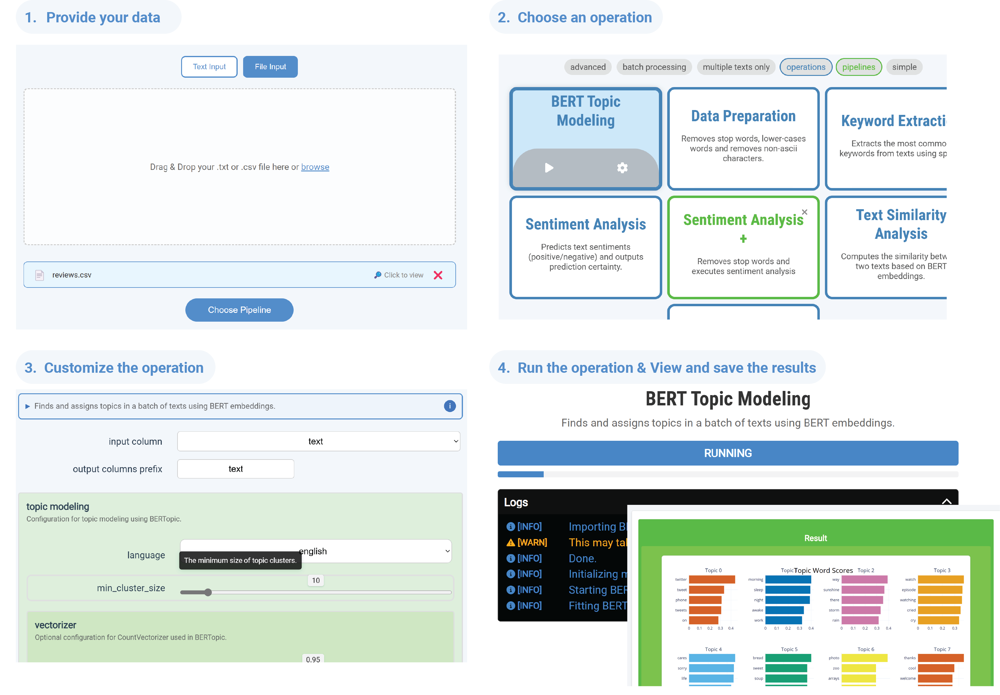

# NLP4Edu for Users



## Installation

This app is currently only built for **Windows**. It is packaged with all necessary libraries, so no additional software installation is required (which makes the download larger).

To use the app, simply download the folder from the following link:  
- 👉[NLP4EDU V1.3](https://uni-duesseldorf.sciebo.de/s/hB4Gsw6EY051Myx)👈

This bundle includes the executable (`.exe`) as well as a folder with sample input files.

> **⚠️ Before installing a new version**, remove old temporary files to reset your settings:  
> 1. Open `C:\Users\<username>\AppData\Roaming`  
> 2. Delete the folder named `NLP Toolkit`  
>
> This will also clear any previous configurations you’ve made.

## Who is this App for?
This App enables researchers to use common natural language processing (NLP) methods for data analysis. It provides an **easy-to-use interface** for configuring and running various NLP tasks, **no coding skills required**. 🎉

## Functionalities

Generally, you want to provide the app with an input `csv` file resembling a table with different text columns. These texts will then be processed by one of the following operations and put into a new or altered `csv` file, which can then be saved. You may configure the operations and get more detailed insights regarding how they work and how to configure them properly within the configuration page in the app.

### Operations

- **Data Preparation 🧹**  
  Cleans up your text by removing filler words (e.g., “the”, “and”), converting everything to lowercase, and stripping out odd characters (like emojis or symbols). You’ll get tidy text and a quick bar chart showing which common words were dropped.  
  [Explore spaCy Models](https://spacy.io/usage/models)

- **Keyword Extraction 🔑**  
  Finds the most important words in your text column (default: top 5). It filters out common words and counts which ones appear most often, then adds them to your dataset and shows you a little preview in HTML.  
  [More on spaCy Language Models](https://spacy.io/models)

- **Sentiment Analysis 😊😞**  
  Tells you whether each piece of text feels **positive** or **negative**, along with a confidence score (0–1). Uses ready-made Hugging Face models for English and German, then adds two new columns: one for the label and one for the score. You can also check out a sample chart of sentiment distribution.  
  [Hugging Face Pipelines](https://huggingface.co/docs/transformers/main_classes/pipelines)

- **Text Similarity 🤝**  
  Measures how alike two text fields are. It turns sentences into number-based “embeddings” and calculates a score (cosine similarity) between them. You can compare two specific columns or every possible pair, then preview the top matches.  
  [Learn about Transformers](https://huggingface.co/docs/transformers)

- **Word List Scan 📋**  
  Lets you scan text for words or patterns you care about. Just give it lists of plain words or regex patterns, and it’ll count how many times each list appears in your text. Handy for spotting keywords or custom patterns.

- **BERTopic Modeling 🗂️**  
  Discovers hidden themes in your documents and summarizes each theme with a handful of keywords. Here’s how it works:  
  1. **Turn text into vectors** using a lightweight BERT model (multilingual or English-only).  
  2. **Group similar texts** with a smart clustering algorithm that also marks outliers.  
  3. **Highlight top keywords** per group with a “class-based TF-IDF” formula.  
  4. **Interactive charts** let you explore topics, see topic hierarchies, and check topic relevance—all with Plotly.  
  In plain terms: it reads your documents, finds clusters of similar content, and tells you what each cluster is about in a few key words. Perfect for getting the big picture quickly!  
  [Check out BERTopic](https://maartengr.github.io/BERTopic/index.html)


---

## Usage Guide

### 1. Start the App 🚀
- Double-click the `NLP4Edu.exe`.  
- **First run** may take a few minutes as all components initialize; subsequent runs will be faster.  
- Settings are stored in `C:\Users\<username>\AppData\Roaming\NLP Toolkit`. Deleting this folder before upgrading ensures a clean start.

### 2. Input Screen 📂
- **Load your data** by dragging & dropping a `.csv` file (or `.txt`, which will be treated as a single-column CSV) into the app.  
- **CSV format tips**:  
  - Use commas (`,`) as separators (German systems sometimes default to semicolons).  
  - If a cell spans multiple lines, wrap the entire entry in double quotes:  
    ```
    "Line one
    Line two"
    ```  
  - To include quotes inside text, double them:  
    ```
    Marie says: ""I like cheese!""
    ```  
- Sample files are available in the `input_examples` folder.

### 3. Select Operation 🔍
- Click **Select Operation** to choose which NLP task to run.  
- You can either hit **Play** to start immediately or click the **Plus (+)** button to add this step to a **pipeline** (chain multiple operations in sequence).  
- **Tip**: Pipelines are great for preprocessing steps (e.g., Data Preparation → Keyword Extraction), but for most single tasks you can run them directly.

### 4. Configure Operation ⚙️
- The configuration pane shows the chosen operation name and your input preview.  
- Click the operation to expand its settings:  
  - **Specify the exact column name** containing your text.  
  - Read the detailed description for usage tips and pipeline hints.  
- After making changes, click **Save** to apply or **Revert** to undo.

### 5. Execute & Review ▶️
- Press **Play** to run the operation (or pipeline).  
- Watch the **log messages** update in real time—this shows progress and any warnings or errors.  
- Execution time depends on your operation and dataset size; first-time runs may also download or initialize dependencies.  
- When complete, you can **preview results** in the app or **export** the modified CSV.

### 6. Navigate Between Steps 🔄
- You can jump back to any of the four steps (1–4) by clicking the step numbers at the top.  
- **Recommendation**: Finish the current run before switching steps to avoid confusing your workflow.

Enjoy exploring your text data! 🚀✨


---
# NLP4Edu for Developers

***(This is a more technical section, for developers who want to extend the app)***

This project is an NLP (Natural Language Processing) toolkit built with **pywebview**, **React**, and **TypeScript**. The application allows users to create, configure, and run NLP pipelines with various processing steps.

## Folder Structure

```plaintext
nlp-toolkit-app/
├── src/
│   ├── assets/               # Static assets for the application (icons, images, etc.)
│   ├── backend/              # Backend Python code
│   │   ├── operations/         # Individual NLP operation modules (e.g., tokenization, stemming)
│   │   ├── run/                # Logic related to pipeline execution
│   │   ├── storage/            # Backend storage handling (may include caching or configurations)
│   │   ├── tests/              # Backend test suites
│   │   └── transferObjects/    # Data Transfer Objects and backend API
│   │   ├── Api.py            # Python API exposed to the frontend via pywebview
│   │   ├── generaltypes.py   # General type definitions shared within backend
│   │   ├── parameterTypes.py # Parameter definitions for operations
│   │   ├── register.py       # Logic to register operations/pipelines and link configs to their operation code.
│   │   └── utils.py          # Backend utility functions
│   ├── frontend/              # Frontend React/TypeScript application
│   │   ├── components/          # Reusable UI components
│   │   ├── screens/             # High-level screens (LandingPage, PipelineConfigScreen, etc.)
│   │   ├── styles/              # SCSS files for styling
│   │   ├── types/               # TypeScript type definitions (e.g. Pipeline, Step)
│   │   └── utils/               # Frontend utilities (e.g., API interaction)
└── storage/                   # Top-level storage, may contain pipeline JSON files or persistent data
    ├── inputs/                 # Stored user inputs (CSV, TXT, typed-in text)
    ├── pipelines/              # Definition Files for Pipelines (which steps, which configuration).
    ├── runs/                   # Stores single runs with unique ids and outputs. 
    └── steps/                  # Definition Files for Steps/Operations. Will be linked to a python operation class in register.py.
```

## Key Files
- src/backend/transferObjects/Api.py: Contains Python API functions (e.g., save_pipeline, load_pipeline), exposed to the frontend via pywebview.
- src/frontend/screens/: Contains main screens for the application:
  - LandingPage: Entry point for users.
  - PipelineConfigScreen: Configure and visualize your NLP pipelines.
  - ResultScreen: Display and analyze pipeline execution results.
- src/frontend/types/: TypeScript type definitions for ensuring consistent data handling throughout the application.
- src/frontend/utils/: Frontend utility functions, for example:
  - pipelineApi.ts (or similar) to load, save, and list pipelines via the backend API.
- main.py (if present at the root): Initializes the pywebview window and links the Api class to the frontend, enabling the frontend to call backend functions directly.

## Extendable design

The general design idea is to make (nlp) operations easily implementable in a way that the app renders it in a user-friendly GUI.
There are multiple ways you may extend this app:

- **Add Operations**:
  - This is the general use case. Add a new StepOperation Python class in backend/operations/ and a .json configuration in storage/steps and link them in backend/register.py
  - Start with the configuration:
    - Define Operation meta-data (name, id, description etc.)
    - First, you want to define which static parameters (configurable before run, i.e. settings) the user should specify and the input method (slider, text_field, list, ... (may also be extended in register.py))
    - Then define a input-output definition. This will say which inputs you expect in the payload and which outputs you will generate.
    - If an input is of a certain type (e.g. "tensor") you may define the type and its behavious in register.py
  - Then define the actual operation python code:
    - Operations receive a frontend notifier (for logs and status reports) and a payload object. All the data of previous steps may be loaded from the payload. The most important data object is payload.data
    - payload.data is a pandas dataframe representing the csv data the user provided and that has been modifier thus far in the pipeline
    - after your operation finished add a visualization object to the payload and output according status reports
  - For more information have a look on the operations that have already been implemented. You may also use ParallelizableTextOperation instead of StepOperation if your operation only need text as input.
      
- **Add new Visualization methods**
  - After a step has successfully run it's result is shown via a Visualization object that is mapped to a frontend React component
  - You may either define some custom HTML in the backend and use HTMLVisualization or define a new Visualization method
  - If you choose to do so, add both a new Visualization sub-class in the backend and link it to a new Visualization React component in the frontend
  
- **Add Data Fields and Data Pickers**
  - You may define your own data types and the parsing therof in register.py
  - You may also define custom data pickers. For this register a data picker in register.py and map it to an according frontend picker class in DynamicPicker.tsx


## Getting Started
### Install Dependencies:
Run pip install -r requirements.txt for Python dependencies and npm install for frontend dependencies.

### Run the Application:
Then, start the frontend with npm run start. The application should open with the React UI connected to the backend.

### Building the Frontend:
When ready to bundle for production, run npm run build to generate optimized frontend assets.

# Further Questions

Don't hesitate to contact me!
