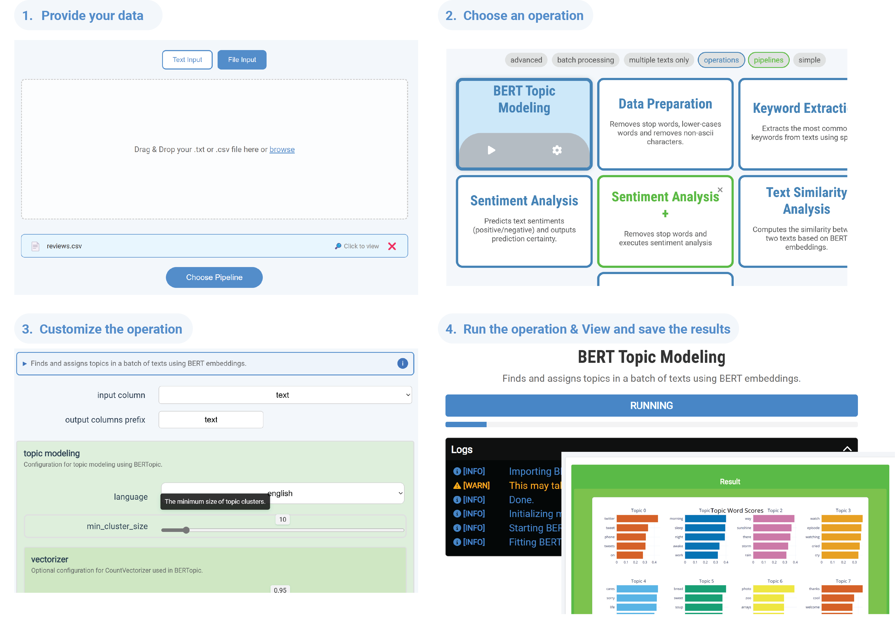

# NLP4Edu for Users



## Installation

This app is currently only built for **Windows**. It is packaged with all necessary libraries, so no additional software installation is required (which makes the download larger).

To use the app, simply download the folder from the following link:  
- 👉[NLP4EDU V1.3](https://uni-duesseldorf.sciebo.de/s/hB4Gsw6EY051Myx)👈

This bundle includes the executable (`.exe`) as well as a folder with sample input files.

> **⚠️ Before installing a new version**, remove old temporary files to reset your settings:  
> 1. Open `C:\Users\<username>\AppData\Roaming`  
> 2. Delete the folder named `NLP Toolkit`  
>
> This will also clear any previous configurations you’ve made.

## Who is this App for?
This App enables researchers to use common natural language processing (NLP) methods for data analysis. It provides an **easy-to-use interface** for configuring and running various NLP tasks, **no coding skills required**. 🎉

## Functionalities

Generally, you want to provide the app with an input `csv` file resembling a table with different text columns. These texts will then be processed by one of the following operations and put into a new or altered `csv` file, which can then be saved. You may configure the operations and get more detailed insights regarding how they work and how to configure them properly within the configuration page in the app.

### Operations

- **Data Preparation 🧹**  
  Cleans up your text by removing filler words (e.g., “the”, “and”), converting everything to lowercase, and stripping out odd characters (like emojis or symbols). You’ll get tidy text and a quick bar chart showing which common words were dropped.  
  [Explore spaCy Models](https://spacy.io/usage/models)

- **Keyword Extraction 🔑**  
  Finds the most important words in your text column (default: top 5). It filters out common words and counts which ones appear most often, then adds them to your dataset and shows you a little preview in HTML.  
  [More on spaCy Language Models](https://spacy.io/models)

- **Sentiment Analysis 😊😞**  
  Tells you whether each piece of text feels **positive** or **negative**, along with a confidence score (0–1). Uses ready-made Hugging Face models for English and German, then adds two new columns: one for the label and one for the score. You can also check out a sample chart of sentiment distribution.  
  [Hugging Face Pipelines](https://huggingface.co/docs/transformers/main_classes/pipelines)

- **Text Similarity 🤝**  
  Measures how alike two text fields are. It turns sentences into number-based “embeddings” and calculates a score (cosine similarity) between them. You can compare two specific columns or every possible pair, then preview the top matches.  
  [Learn about Transformers](https://huggingface.co/docs/transformers)

- **Word List Scan 📋**  
  Lets you scan text for words or patterns you care about. Just give it lists of plain words or regex patterns, and it’ll count how many times each list appears in your text. Handy for spotting keywords or custom patterns.

- **BERTopic Modeling 🗂️**  
  Discovers hidden themes in your documents and summarizes each theme with a handful of keywords. Here’s how it works:  
  1. **Turn text into vectors** using a lightweight BERT model (multilingual or English-only).  
  2. **Group similar texts** with a smart clustering algorithm that also marks outliers.  
  3. **Highlight top keywords** per group with a “class-based TF-IDF” formula.  
  4. **Interactive charts** let you explore topics, see topic hierarchies, and check topic relevance—all with Plotly.  
  In plain terms: it reads your documents, finds clusters of similar content, and tells you what each cluster is about in a few key words. Perfect for getting the big picture quickly!  
  [Check out BERTopic](https://maartengr.github.io/BERTopic/index.html)


---

## Usage Guide

### 1. Start the App 🚀
- Double-click the `NLP4Edu.exe`.  
- **First run** may take a few minutes as all components initialize; subsequent runs will be faster.  
- Settings are stored in `C:\Users\<username>\AppData\Roaming\NLP Toolkit`. Deleting this folder before upgrading ensures a clean start.

### 2. Input Screen 📂
- **Load your data** by dragging & dropping a `.csv` file (or `.txt`, which will be treated as a single-column CSV) into the app.  
- **CSV format tips**:  
  - Use commas (`,`) as separators (German systems sometimes default to semicolons).  
  - If a cell spans multiple lines, wrap the entire entry in double quotes:  
    ```
    "Line one
    Line two"
    ```  
  - To include quotes inside text, double them:  
    ```
    Marie says: ""I like cheese!""
    ```  
- Sample files are available in the `input_examples` folder.

### 3. Select Operation 🔍
- Click **Select Operation** to choose which NLP task to run.  
- You can either hit **Play** to start immediately or click the **Plus (+)** button to add this step to a **pipeline** (chain multiple operations in sequence).  
- **Tip**: Pipelines are great for preprocessing steps (e.g., Data Preparation → Keyword Extraction), but for most single tasks you can run them directly.

### 4. Configure Operation ⚙️
- The configuration pane shows the chosen operation name and your input preview.  
- Click the operation to expand its settings:  
  - **Specify the exact column name** containing your text.  
  - Read the detailed description for usage tips and pipeline hints.  
- After making changes, click **Save** to apply or **Revert** to undo.

### 5. Execute & Review ▶️
- Press **Play** to run the operation (or pipeline).  
- Watch the **log messages** update in real time—this shows progress and any warnings or errors.  
- Execution time depends on your operation and dataset size; first-time runs may also download or initialize dependencies.  
- When complete, you can **preview results** in the app or **export** the modified CSV.

### 6. Navigate Between Steps 🔄
- You can jump back to any of the four steps (1–4) by clicking the step numbers at the top.  
- **Recommendation**: Finish the current run before switching steps to avoid confusing your workflow.

Enjoy exploring your text data! 🚀✨


For information on how to contribute to NLP4EDU, including details on the project's architecture and how to extend it, please see our [CONTRIBUTING.md](CONTRIBUTING.md) guide.

# Further Questions

Don't hesitate to contact me!

